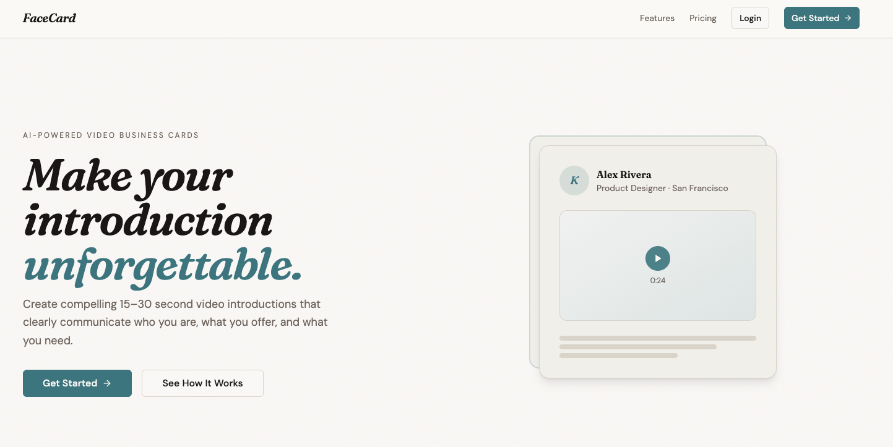

# FaceCard — AI-Powered Video Business Cards



FaceCard lets professionals create a 15–30 second video introduction in minutes. An AI-written script, browser-based recording, and an instantly shareable link — no equipment, no editing, no friction.

---

## Tech Stack

| Layer | Choice |
| --- | --- |
| Framework | Next.js 14 (App Router) with TypeScript |
| Styling | Tailwind CSS + shadcn/ui |
| AI | Anthropic Claude (`claude-opus-4-8`) via `@anthropic-ai/sdk` |
| Video recording | Loom Record SDK + oEmbed |
| Auth | NextAuth.js with Google and LinkedIn OAuth |
| Fonts | Fraunces (display) + DM Sans (body) via `next/font` |

---

## Key Features

- **AI script generation** — Claude writes a personalized script from the user's profile, skills, and goals. System prompt enforces spoken-word-only output; no stage directions or scene markers survive into the final script.
- **Browser-based recording** — Loom SDK handles camera capture with the script visible on screen. No installs, no uploads.
- **Multi-step form with localStorage persistence** — profile data is stored client-side across the 5-step flow so progress survives navigation and page refreshes.
- **Context-aware homepage CTA** — returning authenticated users see a "Pick up where you left off" card that reads localStorage and routes them to the correct step rather than back to the beginning.
- **Branded auth error handling** — custom NextAuth error page with clear copy for `OAuthAccountNotLinked` and other provider errors.
- **Design system** — custom CSS variable palette (warm cream / ink / deep teal) applied via shadcn's variable cascade, so all components re-theme from a single `globals.css` change.

---

## Project Structure

```text
src/
├── app/
│   ├── api/
│   │   ├── auth/[...nextauth]/   # NextAuth route with Google + LinkedIn
│   │   ├── generate-script/      # Claude API route for script generation
│   │   └── upload-avatar/        # Avatar upload handler
│   ├── auth/error/               # Custom branded auth error page
│   ├── create-profile/           # 5-step onboarding flow
│   │   ├── page.tsx              # Step 1: Profile info
│   │   ├── interests/            # Step 2: Skills & interests
│   │   ├── script/               # Step 3: AI script generation + editing
│   │   ├── video/                # Step 4: Loom recording
│   │   └── share/                # Step 5: Shareable link + QR + embed
│   ├── features/                 # Marketing features page
│   └── pricing/                  # Free + Pro pricing page
├── components/
│   ├── resume-card.tsx           # Context-aware returning-user CTA
│   ├── header.tsx
│   ├── footer.tsx
│   └── ui/                       # shadcn/ui components
└── lib/
    ├── form-utils.ts             # localStorage persistence helpers
    ├── openai-enhanced.ts        # Script versioning + history
    └── script-generator.ts       # Fallback script generation
```

---

## Getting Started

### Prerequisites

- Node.js 18+
- Google OAuth credentials
- LinkedIn OAuth credentials
- Anthropic API key
- Loom Public App ID (sandbox for dev, production for prod)

### Installation

```bash
git clone https://github.com/dfrho/facecard.git
cd facecard
npm install
```

### Environment Variables

Create `.env.local` in the project root:

```env
# Auth
NEXTAUTH_URL=http://localhost:3000
NEXTAUTH_SECRET=your-secret-here

# Google OAuth
GOOGLE_CLIENT_ID=your-google-client-id
GOOGLE_CLIENT_SECRET=your-google-client-secret

# LinkedIn OAuth
LINKEDIN_CLIENT_ID=your-linkedin-client-id
LINKEDIN_CLIENT_SECRET=your-linkedin-client-secret

# Anthropic
CLAUDE_API_KEY=your-anthropic-api-key

# Loom
NEXT_PUBLIC_LOOM_SANDBOX_PUBLIC_APP_ID=your-sandbox-app-id
NEXT_PUBLIC_LOOM_PUBLIC_APP_ID=your-production-app-id
```

### Run

```bash
npm run dev
```

Open [http://localhost:3000](http://localhost:3000).

---

## Pricing

| Plan | Price | Cards | Script generations | Recordings |
| --- | --- | --- | --- | --- |
| Free | $0 | 1 | Up to 3 | 1 |
| Pro | $45/mo | 5 | Unlimited | Unlimited |

---

## Roadmap

- [ ] Supabase integration for persistent user data and avatar storage
- [ ] Dashboard for managing multiple cards
- [ ] Stripe integration for Pro billing
- [ ] Custom slug support (`facecard.ai/v/yourname`)
- [ ] Analytics (view counts, link clicks)
